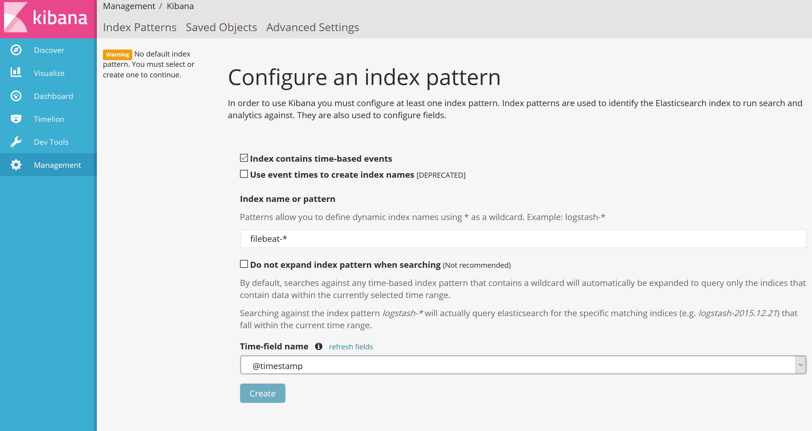
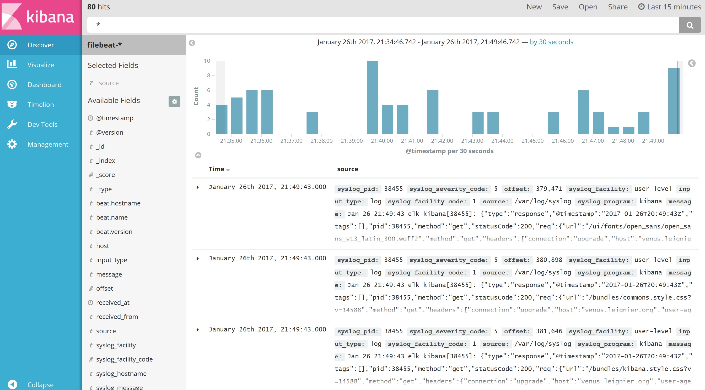

# Elastic-Stack-5.0

This is a documentation / Walkthrough on how to install Elastic Stack on Ubuntu 16.04 Server

##Elastic-Stack-5.0 Installation Guide

###Author Stephane

####Minimum System Requirements
    OS: Ubuntu 16.04
    RAM: 5GB
    CPU: 2


| Software      | Version       |
| ------------- | ------------- |
| Elasticsearch | 5.1.2         |
| Logstash      | 5.1.2-1         |
| Kibana        | 5.1.2         |
| Filebeat         | 5.1.0         |
| X-Pack        | 5.1.0         |
| Nginx         | 1.10.0        |
| Java          | 1.8.0_121     |
 

##Follow These Steps To Get A Full ELK Installation


###    Java Setup: Install Java 8
   
   Elasticsearch and Logstash require Java. We will install a recent version of Oracle Java 8 because that is what Elasticsearch recommends.
   
   Add the Oracle Java PPA to `apt`:
   ```shell
   $ sudo add-apt-repository -y ppa:webupd8team/java`
   ```
   
   Update the `apt` package database.
   ```shell
   $ sudo apt update
   ```
   
   Install the latest stable version of Oracle Java 8 with this command (and accept the license agreement that pops up):
   ```shell
   $ sudo apt install oracle-java8-installer
   ```

###Setting the JAVA_HOME Environment Variable

Many programs, such as Java servers, use the `JAVA_HOME` environment variable to determine the Java installation location. To set this environment variable, we will first need to find out where Java is installed. You can do this by executing the same command as in the previous section:
```shell
   $ sudo update-alternatives --config java
```
Copy the path from your preferred installation and then open `/etc/environment` using nano or your favorite text editor.
```shell
   $ sudo nano /etc/environment
```
At the end of this file, add the following line, making sure to replace the highlighted path with your own copied path.
```
JAVA_HOME="/usr/lib/jvm/java-8-oracle/jre/bin/java"
export JAVA_HOME
```

Save and exit the file, and reload it.
```shell
   $ source /etc/environment
```

You can now test whether the environment variable has been set by executing the following command:
```shell
  $ echo $JAVA_HOME
```
This will return the path you just set.
   
Proceed with Elasticsearch installation.
   
###Install Elasticsearch

   First of all we need to configure Elastic Apt repository.
   
   Download and install the Public Signing Key
   ```shell
   $ wget -qO - https://artifacts.elastic.co/GPG-KEY-elasticsearch | sudo apt-key add -
   ```
   You may need to install the apt-transport-https package on Debian before proceeding:
   ```shell
   $ sudo apt-get install apt-transport-https
   ```
   Save the repository definition to /etc/apt/sources.list.d/elastic-5.x.list:
   ```shell
   $ echo "deb https://artifacts.elastic.co/packages/5.x/apt stable main" | sudo tee -a /etc/apt/sources.list.d/elastic-5.x.list
   ```
   Run sudo apt-get update and the repository is ready for use. You can install it with:
   ```shell
   $ sudo apt-get update && sudo apt-get install elasticsearch
   ```
   Elasticsearch is now installed. Let's edit the configuration:
   ```shell
   $ sudo nano /etc/elasticsearch/elasticsearch.yml
   ```
   
   You will want to restrict outside access to your Elasticsearch instance (port 9200), so outsiders can't read your data or shutdown your Elasticsearch cluster through the HTTP API. Find the line that specifies `network.host`, uncomment it, and replace its value with "localhost" so it looks like this:
   ```YAML
   network.host: localhost
   ```
   Save and exit `elasticsearch.yml`.
   Now, start Elasticsearch:
   ```shell
   $ sudo systemctl restart elasticsearch
   ```
   Then, run the following command to start Elasticsearch on boot up:
   ```shell
   $ sudo systemctl daemon-reload
   $ sudo systemctl enable elasticsearch
   ```
   Now that Elasticsearch is up and running, let's install Kibana.

###Install Kibana

   Update your `apt` package database and install Kibana.
   ```shell
   $ sudo apt-get update && sudo apt-get install kibana
   ```
   Kibana is now installed.

   Open the Kibana configuration file for editing:
   ```shell
   $ sudo nano /etc/kibana/config/kibana.yml
   ```
   In the Kibana configuration file, find the line that specifies server.host, and replace the IP address ("0.0.0.0" by default) with "localhost":
   ```YAML
   server.host: "localhost"
   ```
   Save and exit. This setting makes it so Kibana will only be accessible to the localhost. This is fine because we will use an Nginx reverse proxy to allow external access.

   Now enable the Kibana service, and start it:
   ```shell
   $ sudo systemctl daemon-reload
   $ sudo systemctl enable kibana
   $ sudo systemctl start kibana
   ```
   Before we can use the Kibana web interface, we have to set up a reverse proxy. Let's do that now, with Nginx.

###Install Nginx

   Because we configured Kibana to listen on `localhost`, we must set up a reverse proxy to allow external access to it. We will use Nginx for this purpose.
   >If you already have an Nginx instance that you want to use, feel free to use that instead. Just make sure to configure Kibana so it is reachable by your Nginx server (you probably want to change the host value, in /etc/kibana/config/kibana.yml, to your Kibana server's private IP address or hostname). Also, it is recommended that you enable SSL/TLS.
   
   Use apt to install Nginx:
   ```shell
   $ sudo apt-get -y install nginx
   ```
   Use openssl to create an admin user, called "kibanaadmin" (you should use another name), that can access the Kibana web interface:
   ```shell
   $ sudo -v
   $ echo "kibanaadmin:`openssl passwd -apr1`" | sudo tee -a /etc/nginx/htpasswd.users
   ```
   Enter a password at the prompt. Remember this login, as you will need it to access the Kibana web interface.

   Now open the Nginx default server block in your favorite editor:
   ```shell
   $ sudo nano /etc/nginx/sites-available/default
   ```
   Delete the file's contents, and paste the following code block into the file. Be sure to update the server_name to match your server's name or public IP address:
   ```Nginx

    server {
        listen 80;

        server_name example.com;

        auth_basic "Restricted Access";
        auth_basic_user_file /etc/nginx/htpasswd.users;

        location / {
            proxy_pass http://localhost:5601;
            proxy_http_version 1.1;
            proxy_set_header Upgrade $http_upgrade;
            proxy_set_header Connection 'upgrade';
            proxy_set_header Host $host;
            proxy_cache_bypass $http_upgrade;        
        }
    }
   ```
  Save and exit. This configures Nginx to direct your server's HTTP traffic to the Kibana application, which is listening on `localhost:5601`. Also, Nginx will use the `htpasswd.users` file, that we created earlier, and require basic authentication.

  Now, check the config for syntax errors and restart Nginx if none are found:
   ```shell
   $ sudo nginx -t
   $ sudo systemctl restart nginx
   ```
   If you followed the initial server setup guide for 16.04, you have a UFW firewall enabled. To allow connections to Nginx, we can adjust the rules by typing:
   ```shell
   $ sudo ufw allow 'Nginx Full'
   ```
   Kibana is now accessible via your FQDN or the public IP address of your ELK Server i.e. `http://elk\_server\_public\_ip/`. If you go there in a web browser, after entering the "kibanaadmin" credentials, you should see a Kibana welcome page which will ask you to configure an index pattern. Let's get back to that later, after we install all of the other components.
 
###Install Logstash

   The Logstash package is available from the same repository as Elasticsearch.
   Update your apt package database:
   ```shell
   $ sudo apt-get update
   ```
   Install Logstash with this command:
   ```shell
   $ sudo apt-get install logstash
   ```
   Logstash is installed but it is not configured yet.
   
###Generate SSL Certificates

Since we are going to use Filebeat to ship logs from our Client Servers to our ELK Server, we need to create an SSL certificate and key pair. The certificate is used by Filebeat to verify the identity of ELK Server. Create the directories that will store the certificate and private key with the following commands:
```shell
$ sudo mkdir -p /etc/pki/tls/certs
$ sudo mkdir /etc/pki/tls/private
```
Now you have two options for generating your SSL certificates. If you have a DNS setup that will allow your client servers to resolve the IP address of the ELK Server, use **Option 2**. Otherwise, **Option 1** will allow you to use IP addresses.

####Option 1: IP Address

If you don't have a DNS setup—that would allow your servers, that you will gather logs from, to resolve the IP address of your ELK Server—you will have to add your ELK Server's private IP address to the `subjectAltName` (SAN) field of the SSL certificate that we are about to generate. To do so, open the OpenSSL configuration file:
```shell
$ sudo nano /etc/ssl/openssl.cnf
```
Find the `[ v3_ca ]` section in the file, and add this line under it (substituting in the ELK Server's **private IP address)**:
```
subjectAltName = IP: ELK_server_private_IP
```
Save and exit.

Now generate the SSL certificate and private key in the appropriate locations (/etc/pki/tls/...), with the following commands:
```shell
   $ cd /etc/pki/tls
   $ sudo openssl req -config /etc/ssl/openssl.cnf -x509 -days 3650 -batch -nodes -newkey rsa:2048 -keyout private/logstash-forwarder.key -out certs/logstash-forwarder.crt
```

The *logstash-forwarder.crt* file will be copied to all of the servers that will send logs to Logstash but we will do that a little later. Let's complete our Logstash configuration. If you went with this option, skip option 2 and move on to **Configure Logstash**.

####Option 2: FQDN (DNS)

If you have a DNS setup with your private networking, you should create an A record that contains the ELK Server's private IP address—this domain name will be used in the next command, to generate the SSL certificate. Alternatively, you can use a record that points to the server's public IP address. Just be sure that your servers (the ones that you will be gathering logs from) will be able to resolve the domain name to your ELK Server.

Now generate the SSL certificate and private key, in the appropriate locations (`/etc/pki/tls/...`), with the following (substitute in the FQDN of the ELK Server):
```shell
   $ cd /etc/pki/tls
   $ sudo openssl req -subj '/CN=ELK_server_fqdn/' -x509 -days 3650 -batch -nodes -newkey rsa:2048 -keyout private/logstash-forwarder.key -out certs/logstash-forwarder.crt
```
The *logstash-forwarder.crt* file will be copied to all of the servers that will send logs to Logstash but we will do that a little later. Let's complete our Logstash configuration.

###Configure Logstash

Logstash configuration files are in the JSON-format, and reside in `/etc/logstash/conf.d`. The configuration consists of three sections: inputs, filters, and outputs.

Let's create a configuration file called `02-beats-input.conf` and set up our "filebeat" input:
```shell
   $ sudo nano /etc/logstash/conf.d/02-beats-input.conf
```
Insert the following **input** configuration:
```JSON
    input {
      beats {
        port => 5044
        ssl => true
        ssl_certificate => "/etc/pki/tls/certs/logstash-forwarder.crt"
        ssl_key => "/etc/pki/tls/private/logstash-forwarder.key"
      }
    }
```
Save and quit. This specifies a `beats` input that will listen on TCP port `5044`, and it will use the SSL certificate and private key that we created earlier.

If you followed the Ubuntu 16.04 initial server setup guide, you will have a UFW firewall configured. To allow Logstash to receive connections on port `5044`, we need to open that port:
```shell
$	sudo ufw allow 5044
```
Now let's create a configuration file called 10-syslog-filter.conf, where we will add a filter for syslog messages:
```shell
    sudo nano /etc/logstash/conf.d/10-syslog-filter.conf
```
Insert the following syslog filter configuration:

```JSON
    filter {
      if [type] == "syslog" {
        grok {
          match => { "message" => "%{SYSLOGTIMESTAMP:syslog_timestamp} %{SYSLOGHOST:syslog_hostname} %{DATA:syslog_program}(?:\[%{POSINT:syslog_pid}\])?: %{GREEDYDATA:syslog_message}" }
          add_field => [ "received_at", "%{@timestamp}" ]
          add_field => [ "received_from", "%{host}" ]
        }
        syslog_pri { }
        date {
          match => [ "syslog_timestamp", "MMM  d HH:mm:ss", "MMM dd HH:mm:ss" ]
        }
      }
    }
```

Save and quit. This filter looks for logs that are labeled as "syslog" type (by Filebeat), and it will try to use `grok` to parse incoming syslog logs to make it structured and query-able.

Lastly, we will create a configuration file called `30-elasticsearch-output.conf`:
```shell
   $ sudo nano /etc/logstash/conf.d/30-elasticsearch-output.conf
```
Insert the following **output** configuration:

```JSON
    output {
      elasticsearch {
        hosts => ["localhost:9200"]
        manage_template => false
        index => "%{[@metadata][beat]}-%{+YYYY.MM.dd}"
        document_type => "%{[@metadata][type]}"
      }
    }
```
Save and exit. This output basically configures Logstash to store the beats data in Elasticsearch which is running at `localhost:9200`, in an index named after the beat used (filebeat, in our case).

If you want to add filters for other applications that use the Filebeat input, be sure to name the files so they sort between the input and the output configuration (i.e. between 02- and 30-).

Test your Logstash configuration with this command:
```shell
   $ sudo /opt/logstash/bin/logstash --configtest -f /etc/logstash/conf.d/
```
After a few seconds, it should display `Configuration OK` if there are no syntax errors. Otherwise, try and read the error output to see what's wrong with your Logstash configuration.

Restart Logstash, and enable it, to put our configuration changes into effect:
```shell
   $ sudo systemctl restart logstash
   $ sudo systemctl enable logstash
```
Logstash will be listening for.

###Install Filebeat

The Filebeat package is available from the same repository as Elasticsearch.
Update your apt package database:
```shell
$ sudo apt-get update
```
Install Filebeat with this command:
```shell
$ sudo apt install filebeat
```
Filebeat is installed but it is not configured yet.

###Set Up Filebeat (Add Client Servers)

Do these steps for each Ubuntu or Debian server that you want to send logs to Logstash on your ELK Server.

####Copy SSL Certificate

On your **ELK Server**, copy the SSL certificate you created to your **Client Server** (substitute the client server's address, and your own login):
```shell
   elk$ scp /etc/pki/tls/certs/logstash-forwarder.crt user@client_server_private_address:/tmp
```

After providing your login credentials, ensure that the certificate copy was successful. It is required for communication between the client servers and the ELK Server.

Now, on your **Client Server**, copy the ELK Server's SSL certificate into the appropriate location (`/etc/pki/tls/certs`):
```shell
client$ sudo mkdir -p /etc/pki/tls/certs
client$ sudo cp /tmp/logstash-forwarder.crt /etc/pki/tls/certs/
```

Now we will install the Filebeat package.

###Configure Filebeat
To configure Filebeat, you edit the configuration file.
```shell
$ sudo nano /etc/filebeat/filebeat.yml
```

>Filebeat's configuration file is in YAML format, which means that indentation is very important! Be sure to use the same number of spaces that are indicated in these instructions.

Near the top of the file, you will see the `prospectors` section, which is where you can define prospectors that specify which log files should be shipped and how they should be handled. Each prospector is indicated by the `-` character.

We'll modify the existing prospector to send `syslog` and `auth.log` to Logstash. Under `paths`, comment out the `- /var/log/*.log` file. This will prevent Filebeat from sending every `.log` in that directory to Logstash. Then add new entries for `syslog` and `auth.log`. It should look something like this when you're done:

```YAML
...
      paths:
        - /var/log/auth.log
        - /var/log/syslog
       # - /var/log/*.log
...
```

Then find the line that specifies `document_type:`, uncomment it and change its value to "syslog". It should look like this after the modification:

```YAML
...
      document_type: syslog
...
```

This specifies that the logs in this prospector are of type **syslog** (which is the type that our Logstash filter is looking for).

If you want to send other files to your ELK server, or make any changes to how Filebeat handles your logs, feel free to modify or add prospector entries.

Next, under the `output` section, find the line that says `elasticsearch:`, which indicates the Elasticsearch output section (which we are not going to use). **Delete or comment out the entire Elasticsearch output section** (up to the line that says #logstash:).

Find the commented out Logstash output section, indicated by the line that says `#logstash:`, and uncomment it by deleting the preceding `#`. In this section, uncomment the `hosts: ["localhost:5044"]` line. Change `localhost` to the private IP address (or hostname, if you went with that option) of your ELK server:

```YAML
  ### Logstash as output
  logstash:
    # The Logstash hosts
    hosts: ["ELK_server_private_IP:5044"]
```

This configures Filebeat to connect to Logstash on your ELK Server at port `5044` (the port that we specified a Logstash input for earlier).

Directly under the `hosts` entry, and with the same indentation, add this line:
```YAML
  ### Logstash as output
  logstash:
    # The Logstash hosts
    hosts: ["ELK_server_private_IP:5044"]
    bulk_max_size: 1024
```

Next, find the `tls` section, and uncomment it. Then uncomment the line that specifies `certificate_authorities`, and change its value to `["/etc/pki/tls/certs/logstash-forwarder.crt"]`. It should look something like this:
```YAML
...
    tls:
      # List of root certificates for HTTPS server verifications
      certificate_authorities: ["/etc/pki/tls/certs/logstash-forwarder.crt"]
```

This configures Filebeat to use the SSL certificate that we created on the ELK Server.

Save and quit.

>To test your configuration file, change to the directory where the Filebeat binary is installed, and run Filebeat in the foreground with the following options specified:
```shell
$ /usr/bin/filebeat.sh -configtest -e
```
You should get an answer like this:
```shell
2017/01/24 20:32:55.463849 beat.go:267: INFO Home path: [/usr/share/filebeat] Config path: [/etc/filebeat] Data path: [/var/lib/filebeat] Logs path: [/var/log/filebeat]
2017/01/24 20:32:55.464128 beat.go:177: INFO Setup Beat: filebeat; Version: 5.1.2
2017/01/24 20:32:55.463940 logp.go:219: INFO Metrics logging every 30s
2017/01/24 20:32:55.464627 logstash.go:90: INFO Max Retries set to: 3
2017/01/24 20:32:55.464796 outputs.go:106: INFO Activated logstash as output plugin.
2017/01/24 20:32:55.464972 publish.go:291: INFO Publisher name: elk
2017/01/24 20:32:55.465249 async.go:63: INFO Flush Interval set to: 1s
2017/01/24 20:32:55.465365 async.go:64: INFO Max Bulk Size set to: 1024
Config OK
```

Now restart Filebeat to put our changes into place:
```shell
   $ sudo systemctl restart filebeat
   $ sudo systemctl enable filebeat
```

###Loading the Index Template in Elasticsearch

If you disable automatic template loading (which is our case), you need to run the following command to load the template:
```shell
$ curl -XPUT 'http://localhost:9200/_template/filebeat' -d@/etc/filebeat/filebeat.template.json
```

>Note
If you’ve already used Filebeat to index data into Elasticsearch, the index may contain old documents. After you load the index template, you can delete the old documents from `filebeat-*` to force Kibana to look at the newest documents. Use this command:
```shell
$ curl -XDELETE 'http://localhost:9200/filebeat-*'
```

###Connect to Kibana

When you are finished setting up Filebeat on all of the servers that you want to gather logs for, let's look at Kibana, the web interface that we installed earlier.

In a web browser, go to the FQDN or public IP address of your ELK Server. After entering the "kibanaadmin" credentials, you should see a page prompting you to configure a default index pattern:



Now click the Discover link in the top navigation bar. By default, this will show you all of the log data over the last 15 minutes. You should see a histogram with log events, with log messages below:

